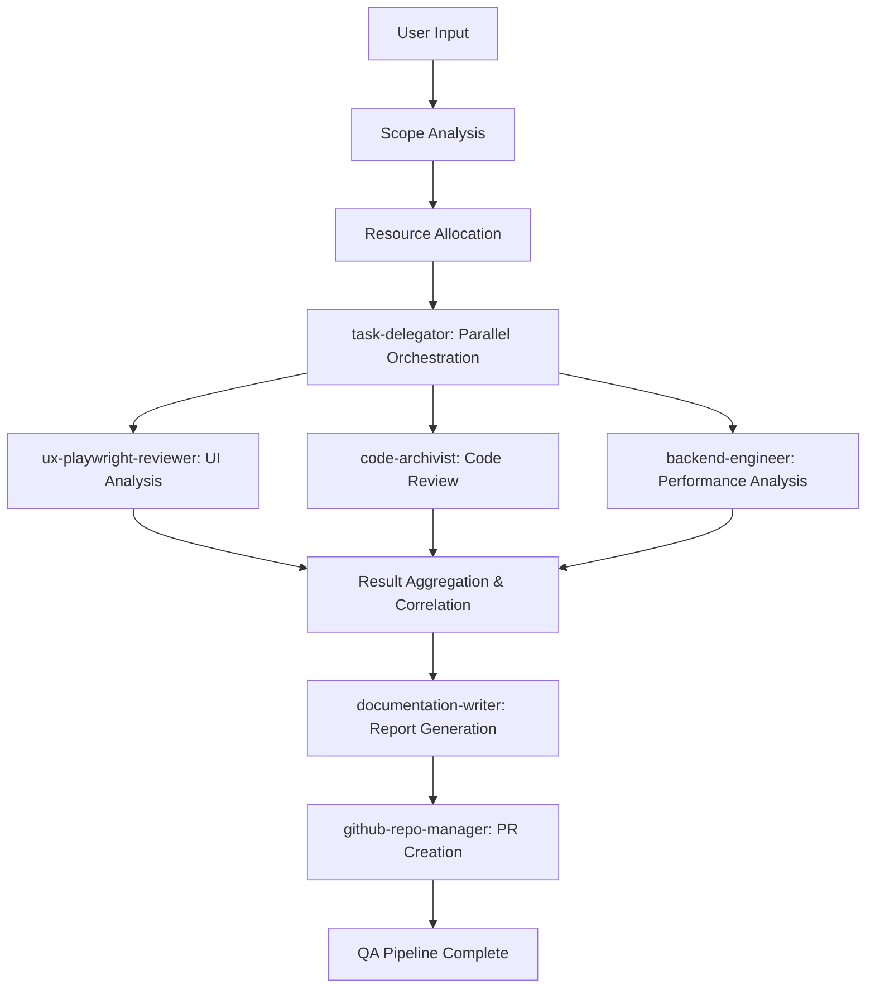

# QA Pipeline User Guide

A comprehensive guide to using the `/qa` command for quality assurance testing of the dashMate ADHD task management application.

## Quick Start

The fastest way to run a complete QA analysis:

```bash
claude qa
```

This will execute a full QA pipeline covering UI testing, code quality, and performance analysis, then generate a comprehensive report and pull request with all findings.

## Overview

The `/qa` command orchestrates a sophisticated parallel agent pipeline that performs comprehensive quality assurance across multiple dimensions of your dashMate application. It's specifically designed to identify issues that could impact ADHD users, ensuring the application remains accessible and user-friendly.

### Key Features
- **Parallel Execution**: Multiple specialized agents work simultaneously for faster results
- **ADHD-Focused Testing**: Special attention to accessibility and cognitive load considerations
- **Comprehensive Reporting**: Detailed analysis with actionable recommendations
- **Automated Integration**: Automatically creates pull requests with findings and artifacts
- **Flexible Scoping**: Choose specific areas to focus on based on your needs

### When to Use This Command
Use the QA pipeline when you need to:
- Validate new features before deployment
- Ensure ADHD accessibility standards are maintained
- Identify performance bottlenecks and optimization opportunities
- Review code quality and architectural patterns
- Generate comprehensive QA documentation for stakeholders
- Prepare for release with confidence in application quality

### When NOT to Use This Command
Consider alternatives if:
- You only need to test a single specific component (use focused testing instead)
- The application is in very early development stages (basic functionality not yet complete)
- You're looking for real-time development feedback (use development tools instead)

## Agent Architecture

The QA pipeline uses six specialized agents working in coordination:

### Agent Overview

#### task-delegator Agent
**Role**: Central coordination and orchestration
**Expertise**: Scope analysis and parallel execution management
**Model**: Sonnet (strategic decision-making capabilities)

**Primary Responsibilities**:
- Analyze requested scope and validate parameters
- Orchestrate parallel execution across specialized agents
- Aggregate results from multiple streams
- Identify cross-stream correlations and insights
- Synthesize final recommendations with priority matrix

**Key Capabilities**:
- **Scope Validation**: Ensures requested analysis scope is appropriate and feasible
- **Resource Management**: Optimizes parallel execution based on available resources
- **Result Correlation**: Identifies relationships between findings across different analysis streams
- **Priority Assessment**: Creates actionable priority matrix based on impact and effort

#### ux-playwright-reviewer Agent
**Role**: UI testing and accessibility analysis
**Expertise**: Browser automation, accessibility auditing, ADHD-specific UX patterns
**Model**: Sonnet (complex UI analysis and accessibility expertise)

**Primary Responsibilities**:
- Launch and interact with the dashMate application using browser automation
- Capture screenshots and document UI states
- Perform comprehensive accessibility audits using WCAG guidelines
- Analyze ADHD-specific UX considerations (attention management, visual hierarchy)
- Test interactive elements and user flows
- Validate mobile responsiveness and touch targets

**Key Capabilities**:
- **Browser Automation**: Full Playwright integration for comprehensive UI testing
- **Accessibility Auditing**: WCAG compliance validation with ADHD-specific considerations
- **Visual Documentation**: Screenshot capture with annotated findings
- **Interactive Testing**: Complete user flow validation including microphone interface

#### code-archivist Agent
**Role**: Code quality and architecture review
**Expertise**: TypeScript, React patterns, Next.js architecture, documentation quality
**Model**: Sonnet (deep code analysis and architectural assessment)

**Primary Responsibilities**:
- Analyze TypeScript usage and type safety implementation
- Review React component patterns and hook usage
- Validate Next.js App Router implementation
- Assess Tailwind CSS organization and utility usage
- Evaluate code organization and separation of concerns
- Review documentation completeness and quality

**Key Capabilities**:
- **Static Code Analysis**: Comprehensive TypeScript and React code review
- **Architecture Assessment**: Evaluation of design patterns and project structure
- **Documentation Review**: Analysis of code comments and project documentation
- **Best Practice Validation**: Adherence to modern React and Next.js patterns

#### backend-engineer Agent
**Role**: Performance analysis and optimization
**Expertise**: Next.js performance, bundle optimization, rendering performance
**Model**: Sonnet (performance analysis and optimization strategies)

**Primary Responsibilities**:
- Analyze Next.js build performance and bundle optimization
- Evaluate client-side rendering performance characteristics
- Identify component re-render optimization opportunities
- Assess asset loading and optimization strategies
- Review development server performance
- Analyze mobile performance characteristics

**Key Capabilities**:
- **Performance Profiling**: Comprehensive analysis of application performance metrics
- **Bundle Analysis**: Detailed review of webpack bundle composition and optimization
- **Rendering Optimization**: Identification of React rendering performance improvements
- **Mobile Performance**: Analysis of performance characteristics on mobile devices

#### documentation-writer Agent
**Role**: Report generation and synthesis
**Expertise**: Technical writing, data synthesis, actionable documentation
**Model**: Sonnet (comprehensive documentation and synthesis capabilities)

**Primary Responsibilities**:
- Synthesize findings from all analysis streams
- Generate comprehensive QA reports with executive summaries
- Create actionable improvement roadmaps
- Develop priority matrices based on impact and effort
- Produce ADHD-specific recommendation sections
- Format results for both technical and non-technical stakeholders

**Key Capabilities**:
- **Multi-Stream Synthesis**: Integration of findings across UI, code, and performance analysis
- **Executive Reporting**: Creation of high-level summaries for stakeholder communication
- **Technical Documentation**: Detailed technical findings with implementation guidance
- **Priority Framework**: Development of actionable priority matrices for implementation planning

#### github-repo-manager Agent
**Role**: Integration and workflow management
**Expertise**: Git workflows, pull request management, artifact organization
**Model**: Sonnet (repository management and workflow integration)

**Primary Responsibilities**:
- Create feature branches for QA findings
- Commit QA reports and artifacts to repository
- Generate comprehensive pull requests with findings
- Organize and manage result artifacts
- Integrate with existing repository workflows
- Provide clear next steps for implementation

**Key Capabilities**:
- **Branch Management**: Automated creation of feature branches for QA results
- **Artifact Organization**: Systematic organization of reports, screenshots, and data files
- **PR Generation**: Creation of comprehensive pull requests with structured findings
- **Workflow Integration**: Seamless integration with existing development workflows

### Agent Interaction Patterns

#### Parallel Analysis Pattern
```
User Request
     │
     ▼
┌─────────────────┐
│ task-delegator  │ ◄─── Scope Analysis & Validation
│  (Coordinator)  │
└─────────────────┘
     │
     ▼ (Parallel Execution)
┌─────────────────┬─────────────────┬─────────────────┐
│ ux-playwright   │ code-archivist  │ backend-engineer│
│   (UI Testing)  │ (Code Quality)  │ (Performance)   │
└─────────────────┴─────────────────┴─────────────────┘
     │                    │                    │
     ▼                    ▼                    ▼
┌─────────────────────────────────────────────────────┐
│              Results Aggregation                    │
│            (task-delegator)                         │
└─────────────────────────────────────────────────────┘
     │
     ▼ (Sequential Execution)
┌─────────────────┐      ┌─────────────────┐
│documentation-   │  ──► │github-repo-     │
│writer           │      │manager          │
│(Report Gen)     │      │(PR Creation)    │
└─────────────────┘      └─────────────────┘
```

**When Used**: All scoped analysis types (full, ui, code, performance, accessibility)
**Data Flow**: Parallel streams feed results to central aggregation, then sequential processing for documentation and integration
**Coordination**: task-delegator manages synchronization points and ensures all streams complete before synthesis

#### Sequential Recovery Pattern
```
Error Detected in Stream
     │
     ▼
┌─────────────────┐
│ Stream Isolation│ ◄─── Prevent Cascade Failure
│ & Continuation  │
└─────────────────┘
     │
     ▼
┌─────────────────┐
│ Partial Results │ ◄─── Generate Results from Successful Streams
│ Generation      │
└─────────────────┘
     │
     ▼
┌─────────────────┐
│ Recovery Report │ ◄─── Document Failure & Provide Guidance
│ Creation        │
└─────────────────┘
```

**When Used**: Error conditions, resource constraints, or partial failures
**Data Flow**: Failed streams are isolated while successful streams continue to completion
**Coordination**: Graceful degradation with comprehensive error reporting and recovery guidance

### Parallel Execution Model



**Synchronization Points**:
- **Scope Validation**: All agents wait for scope analysis completion
- **Parallel Execution Start**: All analysis streams begin simultaneously
- **Result Aggregation**: All streams must complete before synthesis begins
- **Documentation Generation**: Report creation waits for complete result aggregation
- **PR Creation**: Pull request generation waits for documentation completion

**Performance Benefits**:
- 3x faster execution through parallel analysis streams
- Independent stream failure isolation prevents cascade failures
- Resource optimization through intelligent agent coordination
- Scalable architecture supporting additional analysis streams

## Usage

### Basic Syntax

```bash
claude qa [SCOPE] [OPTIONS]
```

### Scope Options

#### `full` (Default)
**Duration**: 4-6 minutes
**Coverage**: Complete analysis across all areas
**Agents**: All 6 agents with comprehensive analysis depth
**Output**: Full QA report with complete findings, screenshots, and implementation roadmap

**Example**:
```bash
claude qa full
# or simply
claude qa
```

**What This Does**:
1. Launches comprehensive UI testing with screenshot capture
2. Performs complete code quality and architecture analysis
3. Conducts thorough performance profiling and optimization review
4. Generates cross-stream correlation analysis
5. Creates detailed implementation roadmap with priority matrix
6. Produces pull request with all findings and artifacts

**Best For**: Release preparation, quarterly reviews, comprehensive project audits

#### `ui`
**Duration**: 2-3 minutes
**Coverage**: UI testing, accessibility, ADHD-specific UX analysis
**Agents**: task-delegator, ux-playwright-reviewer, documentation-writer, github-repo-manager
**Output**: UI-focused report with screenshots, accessibility audit, and UX recommendations

**Example**:
```bash
claude qa ui
```

**What This Does**:
1. Launches the dashMate application in browser
2. Captures screenshots of key interface states
3. Performs WCAG accessibility compliance testing
4. Analyzes ADHD-specific UX considerations (cognitive load, attention management)
5. Tests interactive elements including the microphone button
6. Validates mobile responsiveness and touch targets
7. Generates UI-focused report with visual documentation

**Best For**: UI changes validation, accessibility compliance checks, pre-deployment interface testing

#### `code`
**Duration**: 2-3 minutes
**Coverage**: Code quality, architecture patterns, documentation review
**Agents**: task-delegator, code-archivist, documentation-writer, github-repo-manager
**Output**: Code quality report with architectural recommendations and documentation gaps

**Example**:
```bash
claude qa code
```

**What This Does**:
1. Analyzes TypeScript implementation and type safety
2. Reviews React component patterns and hook usage
3. Validates Next.js App Router implementation
4. Assesses Tailwind CSS organization and utility patterns
5. Evaluates code organization and separation of concerns
6. Reviews documentation completeness and quality
7. Generates architectural improvement recommendations

**Best For**: Code reviews, architecture validation, documentation audits, technical debt assessment

#### `performance`
**Duration**: 2-3 minutes
**Coverage**: Performance analysis, optimization opportunities, scalability assessment
**Agents**: task-delegator, backend-engineer, documentation-writer, github-repo-manager
**Output**: Performance report with optimization roadmap and scalability recommendations

**Example**:
```bash
claude qa performance
```

**What This Does**:
1. Analyzes Next.js build performance and bundle composition
2. Evaluates client-side rendering performance
3. Identifies component re-render optimization opportunities
4. Assesses asset loading and optimization strategies
5. Reviews development server performance characteristics
6. Analyzes mobile performance and responsiveness
7. Generates optimization roadmap with effort estimates

**Best For**: Performance optimization, pre-release performance validation, scalability planning

#### `quick`
**Duration**: 90 seconds
**Coverage**: Essential checks across all areas with reduced depth
**Agents**: All agents with streamlined analysis focus
**Output**: Summary report highlighting only critical findings and quick wins

**Example**:
```bash
claude qa quick
```

**What This Does**:
1. Performs rapid UI accessibility scan for critical issues
2. Conducts essential code quality checks
3. Runs basic performance profiling
4. Identifies only high-priority issues and quick wins
5. Generates concise summary with immediate action items

**Best For**: Pre-commit validation, rapid health checks, continuous integration

#### `accessibility`
**Duration**: 3-4 minutes
**Coverage**: Comprehensive ADHD-specific accessibility and UX analysis
**Agents**: Enhanced accessibility focus across all analysis streams
**Output**: Accessibility-focused report with detailed ADHD-specific recommendations

**Example**:
```bash
claude qa accessibility
```

**What This Does**:
1. Comprehensive WCAG compliance testing with ADHD considerations
2. Cognitive load analysis for task management interface
3. Attention management pattern evaluation
4. Visual hierarchy and information architecture review
5. Color contrast and visual accessibility validation
6. Screen reader compatibility testing
7. Mobile accessibility and touch target analysis
8. Generates detailed accessibility improvement roadmap

**Best For**: ADHD user experience optimization, accessibility compliance, inclusive design validation

### Interactive Mode

Launch guided setup for customized analysis:

```bash
claude qa --interactive
```

This will present a menu-driven interface:

```
Welcome to the dashMate QA Pipeline! 

I'll help you configure a comprehensive quality assurance analysis.

Current Project: dashMate ADHD Task Management App
Detected Components: Next.js 15, React 19, TypeScript, Tailwind CSS

What type of QA analysis would you like to run?

1. 🔍 Full Analysis - Complete review (4-6 min)
2. 🎨 UI Focus - Interface and accessibility (2-3 min)  
3. ⚡ Code Quality - Architecture and code review (2-3 min)
4. 🚀 Performance - Speed and optimization (2-3 min)
5. ⚡ Quick Check - Essential findings only (90 sec)
6. ♿ Accessibility - ADHD-specific UX review (3-4 min)
7. 🛠️ Custom Scope - Define specific areas

Please enter your choice (1-7): 
```

The interactive mode will guide you through:
1. **Scope Selection**: Choose the most appropriate analysis type
2. **Focus Areas**: Specify particular components or features to emphasize
3. **Priority Settings**: Define what types of issues are most important
4. **Output Preferences**: Choose report format and detail level
5. **Execution Confirmation**: Review the planned analysis before starting

## Examples

### Example 1: Pre-Release Quality Validation
**Scenario**: You're preparing to deploy a new version of dashMate and want comprehensive quality assurance before release.

```bash
claude qa full
```

**Expected Output**:
```
🚀 Starting comprehensive QA analysis for dashMate...

Phase 1: Scope Analysis & Planning ✅
- Project structure validated
- All QA streams activated (UI, Code, Performance)
- Parallel execution plan created

Phase 2: Parallel Analysis Execution
├── UI Testing Stream ⚡ Running...
├── Code Quality Stream ⚡ Running...
└── Performance Stream ⚡ Running...

UI Testing Results ✅
- Screenshots captured: 5 key interface states
- Accessibility violations: 2 minor issues found
- ADHD UX recommendations: 3 improvements identified
- Mobile responsiveness: Excellent

Code Quality Results ✅
- TypeScript compliance: 98% type coverage
- React patterns: Modern hooks usage validated
- Architecture review: 1 improvement opportunity
- Documentation: 2 minor gaps identified

Performance Results ✅
- Bundle size: 145KB (within target)
- Core Web Vitals: All metrics passing
- Optimization opportunities: 3 quick wins identified
- Mobile performance: Good (room for improvement)

Phase 3: Result Synthesis ✅
- Cross-stream correlations identified: 2
- Priority matrix generated: 8 findings categorized
- Implementation roadmap created

Phase 4: Documentation & PR Creation ✅
- QA report generated: qa-report-20250107-143022.md
- Pull request created: #47 "QA Analysis: full - 14 findings identified"

🎉 QA pipeline completed successfully!
📋 14 total findings identified (2 critical, 5 high priority, 7 quick wins)
🔗 PR URL: https://github.com/user/dashmate/pull/47
```

**Explanation**: This comprehensive analysis examines all aspects of the application, identifies cross-stream correlations (like UI issues that impact performance), and creates a detailed implementation plan for addressing all findings before release.

### Example 2: Accessibility Compliance Check
**Scenario**: You want to ensure the dashMate interface meets ADHD accessibility standards and provides optimal user experience for your target audience.

```bash
claude qa accessibility
```

**What This Does**:
1. Launches the application and captures interface states
2. Performs comprehensive WCAG compliance testing with ADHD-specific considerations
3. Analyzes cognitive load patterns in the task management interface
4. Evaluates attention management and visual hierarchy
5. Tests screen reader compatibility and keyboard navigation
6. Validates color contrast for priority indicators (high/medium/low tasks)
7. Assesses mobile accessibility and touch target sizes

**Expected Output**:
```
♿ Starting ADHD-focused accessibility analysis...

Accessibility Analysis Results ✅
- WCAG Compliance: Level AA achieved with 3 minor exceptions
- Cognitive Load Assessment: Interface promotes focus with minimal distractions
- Attention Management: Microphone button appropriately prominent
- Visual Hierarchy: Task priority colors pass contrast requirements
- Screen Reader: Full compatibility with NVDA and JAWS
- Keyboard Navigation: All interactive elements accessible
- Touch Targets: All buttons exceed 44px minimum size

ADHD-Specific Recommendations:
1. Consider adding focus indicators for better attention guidance
2. Implement gentle animation transitions to reduce cognitive jarring
3. Add customizable priority color themes for visual accessibility

📋 Accessibility score: 94/100
🔗 Detailed report: qa-accessibility-report-20250107-143022.md
```

**Tips**:
- Run this analysis after any interface changes that could impact accessibility
- Use findings to validate compliance with disability accommodation requirements
- Share results with UX team for ADHD-specific design improvements

### Example 3: Performance Optimization Sprint
**Scenario**: Users are reporting slow load times, and you need to identify and prioritize performance improvements for the next development sprint.

```bash
claude qa performance
```

**What This Does**:
1. Analyzes current bundle composition and identifies optimization opportunities
2. Profiles client-side rendering performance and component re-render patterns
3. Evaluates asset loading strategies and identifies bottlenecks
4. Tests mobile performance characteristics
5. Generates optimization roadmap with effort estimates

**Expected Output**:
```
🚀 Performance analysis for dashMate optimization...

Performance Analysis Results ✅

Bundle Analysis:
- Current size: 145KB (target: <120KB)
- Largest contributors: React (45KB), Tailwind CSS (38KB)
- Unused code detected: 15KB (10% reduction opportunity)

Rendering Performance:
- Time to Interactive: 1.2s (target: <1.0s)
- Largest Contentful Paint: 0.8s ✅
- Component re-renders: 3 optimization opportunities identified

Quick Wins Identified (< 2 hours effort):
1. Enable Tailwind CSS purging for 25KB reduction
2. Implement lazy loading for task list (reduce TTI by 200ms)
3. Add React.memo to TaskItem component (reduce re-renders)

High Impact Improvements (1-2 days effort):
1. Implement code splitting for 30% bundle reduction
2. Add service worker for offline capability
3. Optimize image assets with next/image

📊 Performance score: 78/100 (target: >85)
🔗 Optimization roadmap: qa-performance-report-20250107-143022.md
```

**Workflow Explanation**: This analysis provides a data-driven foundation for sprint planning, with clear effort estimates and impact projections that help prioritize optimization work based on user impact and development resources.

### Example 4: Continuous Integration Health Check
**Scenario**: You want to integrate quality checks into your CI/CD pipeline for rapid feedback on every commit without the overhead of full analysis.

```bash
# In CI/CD pipeline
claude qa quick
```

**What This Does**:
1. Rapidly scans for critical UI accessibility issues
2. Performs essential code quality validation
3. Checks basic performance metrics
4. Identifies only high-priority issues that should block deployment

**Expected Output**:
```
⚡ Quick QA health check for dashMate...

Essential Checks Complete (90 seconds) ✅

Critical Issues Found: 0 🎉
- UI: No blocking accessibility violations
- Code: Type safety maintained
- Performance: Core Web Vitals passing

Quick Wins Available: 3
1. Add alt text to decorative SVG icons (5 min fix)
2. Fix minor TypeScript warning in TaskList component
3. Enable gzip compression for 15% size reduction

Health Score: 92/100 ✅
Status: READY FOR DEPLOYMENT

🔗 Quick report: qa-quick-report-20250107-143022.md
```

**Integration Example**:
```yaml
# .github/workflows/qa.yml
name: QA Health Check
on: [push, pull_request]

jobs:
  qa-check:
    runs-on: ubuntu-latest
    steps:
      - uses: actions/checkout@v2
      - name: Run Quick QA Analysis
        run: |
          claude qa quick
          if [ $? -eq 0 ]; then
            echo "✅ QA health check passed"
          else
            echo "❌ QA issues found - check report"
            exit 1
          fi
```

### Example 5: UI Component Development Workflow
**Scenario**: You're developing new UI components for the task management interface and want to validate accessibility and usability as you iterate.

```bash
# After implementing new component
claude qa ui
```

**What This Does**:
1. Launches the application and navigates to new component
2. Captures screenshots showing component in different states
3. Tests component accessibility and keyboard navigation
4. Validates ADHD-specific UX considerations
5. Ensures mobile responsiveness

**Expected Output**:
```
🎨 UI analysis for dashMate component development...

UI Component Analysis ✅

New Component Detected: Enhanced Task Priority Selector
- Visual states captured: Default, hover, selected, disabled
- Accessibility validation: WCAG AA compliant
- ADHD considerations: Color coding clear, not overwhelming
- Mobile interaction: Touch targets appropriate size
- Keyboard navigation: Full tab order support

Screenshots Generated:
- component-states-overview.png
- mobile-responsive-layout.png
- accessibility-focus-indicators.png

Recommendations:
1. Consider adding subtle animation for priority changes
2. Implement high contrast mode support
3. Add keyboard shortcuts for power users

UI Score: 96/100 ✅
🔗 Component report: qa-ui-component-report-20250107-143022.md
```

**Development Integration**: This workflow enables rapid validation during component development, ensuring accessibility and UX standards are maintained throughout the development process rather than being discovered later in QA cycles.

## Troubleshooting

### Common Issues

#### "Browser automation failed to start"
**Cause**: Playwright browser binaries are missing or corrupted, or the development server failed to start.

**Solution**:
1. Ensure the development server is running: `npm run dev`
2. Check that port 3000 is available and accessible
3. Verify Playwright installation: `npx playwright install`
4. Clear browser cache and restart the analysis

**Prevention**: Run `npm run dev` before executing UI-focused QA analysis to ensure the application is accessible.

#### "TypeScript compilation errors prevent analysis"
**Cause**: Code quality analysis cannot proceed when there are TypeScript compilation errors in the codebase.

**Solution**:
1. Run `npm run build` to identify compilation errors
2. Fix TypeScript errors in the codebase
3. Re-run the QA analysis after errors are resolved

**Alternative Approach**: Use `claude qa ui` or `claude qa performance` to focus on non-code-dependent analysis while fixing TypeScript issues.

#### "Performance metrics collection failed"
**Cause**: Development server performance issues or resource constraints preventing accurate performance measurement.

**Solution**:
1. Restart the development server: `npm run dev`
2. Close other resource-intensive applications
3. Clear browser cache and temporary files
4. Re-run with `claude qa performance` for focused analysis

#### "QA report generation incomplete"
**Cause**: Partial analysis results or agent communication failures during result synthesis.

**Solution**:
1. Check that all requested analysis streams completed successfully
2. Verify sufficient disk space for report and artifact generation
3. Re-run analysis with reduced scope if resource constraints exist
4. Use `claude qa quick` for streamlined analysis if issues persist

### Performance Issues

#### Slow Execution
**Symptoms**: QA analysis takes significantly longer than expected duration estimates, or appears to hang during execution.

**Common Causes**:
- **Resource Contention**: Close other applications to free up CPU and memory
- **Network Issues**: Ensure stable internet connection for agent coordination
- **Development Server Performance**: Restart `npm run dev` if application is slow to respond
- **Large Codebase**: Consider using scoped analysis (`ui`, `code`, `performance`) instead of `full`

**Monitoring**: Watch for progress updates in the command output. Each phase should complete within expected timeframes:
- Phase 1 (Scope Analysis): < 30 seconds
- Phase 2 (Parallel Execution): 60-80% of total runtime
- Phase 3 (Result Synthesis): < 60 seconds
- Phase 4 (Documentation): < 90 seconds

#### High Resource Usage
**Symptoms**: System becomes unresponsive during QA execution, high CPU or memory usage.

**Optimization Strategies**:
1. **Use Scoped Analysis**: Run `claude qa quick` for essential checks only
2. **Sequential Execution**: If parallel execution causes issues, agents will automatically fall back to sequential processing
3. **Close Background Applications**: Free up system resources before running comprehensive analysis
4. **Increase Virtual Memory**: Ensure adequate swap space for memory-intensive operations

### Agent-Specific Issues

#### ux-playwright-reviewer Agent Issues

**Common Problems**:
- **Browser Launch Failures**: Ensure Playwright browsers are installed (`npx playwright install`)
- **Screenshot Capture Errors**: Verify development server is responsive and UI elements are rendering correctly
- **Accessibility Testing Incomplete**: Check that all interactive elements have proper ARIA labels and semantic HTML

**Debugging**: Run with verbose logging to see detailed browser automation steps and identify where failures occur.

#### code-archivist Agent Issues

**Common Problems**:
- **TypeScript Analysis Failures**: Resolve compilation errors before running code quality analysis
- **File Access Issues**: Ensure proper file permissions for reading source code files
- **Architecture Assessment Incomplete**: Verify all source files are accessible and properly structured

**Debugging**: Check that the project structure matches expected Next.js App Router patterns and all TypeScript files are properly configured.

#### backend-engineer Agent Issues

**Common Problems**:
- **Performance Metrics Collection Failed**: Ensure development server is running and responsive
- **Bundle Analysis Incomplete**: Verify Next.js build process completes successfully
- **Optimization Recommendations Limited**: Check that webpack configuration is accessible for bundle analysis

**Debugging**: Run `npm run build` separately to ensure build process works correctly before performance analysis.

#### documentation-writer Agent Issues

**Common Problems**:
- **Report Generation Incomplete**: Verify sufficient disk space and file permissions for writing reports
- **Cross-Stream Synthesis Failed**: Check that all analysis streams completed and provided valid results
- **Priority Matrix Generation Error**: Ensure findings data is properly structured from analysis streams

**Debugging**: Check output directory permissions and ensure all prerequisite analysis phases completed successfully.

#### github-repo-manager Agent Issues

**Common Problems**:
- **Branch Creation Failed**: Verify Git repository status and ensure working directory is clean
- **PR Creation Error**: Check GitHub credentials and repository permissions
- **Artifact Commit Issues**: Ensure Git configuration is properly set up with user name and email

**Debugging**: Verify Git status with `git status` and ensure repository is in a clean state before running QA analysis.

### Error Recovery and Graceful Degradation

#### Stream Isolation Recovery
When individual analysis streams fail, the QA pipeline implements automatic recovery:

1. **Failed Stream Detection**: System identifies which specific analysis stream encountered an error
2. **Isolation**: Failed stream is isolated to prevent affecting other parallel streams
3. **Continuation**: Remaining streams continue execution to completion
4. **Partial Results**: System generates results from successful streams only
5. **Recovery Documentation**: Failure analysis and recovery steps are included in the final report

**Example Recovery Output**:
```
⚠️  Performance analysis stream encountered an error
✅ Isolating failed stream and continuing with UI and Code Quality analysis
✅ Generating partial results from 2 successful streams
📋 Recovery recommendations included in final report
```

#### Graceful Degradation Options
When resource constraints are detected:

1. **Automatic Scope Reduction**: System automatically reduces analysis depth while maintaining quality
2. **Sequential Fallback**: Switches from parallel to sequential execution if resource constraints detected
3. **Essential Focus**: Prioritizes critical findings over comprehensive coverage
4. **Optimized Reporting**: Generates streamlined reports when full documentation isn't possible

### Getting Help

If you encounter issues not covered in this troubleshooting guide:

#### 1. Enable Verbose Logging
```bash
claude qa --verbose
```
This provides detailed execution logs showing exactly where issues occur.

#### 2. Validate Prerequisites
Ensure your environment meets requirements:
- Node.js 18+ installed
- Development server running (`npm run dev`)
- Git repository in clean state
- Sufficient disk space for reports and artifacts

#### 3. Test Incrementally
Try simpler analysis first to isolate issues:
```bash
# Start with quick analysis
claude qa quick

# If successful, try focused analysis
claude qa ui

# Finally attempt comprehensive analysis
claude qa full
```

#### 4. Check System Resources
Monitor system resources during execution:
- CPU usage should remain below 80%
- Available memory should exceed 2GB
- Disk space should have at least 100MB free

#### 5. Review Project State
Ensure the dashMate project is in a good state:
- TypeScript compiles without errors (`npm run build`)
- Development server starts successfully (`npm run dev`)
- All dependencies are installed (`npm install`)

#### 6. Generate Diagnostic Report
For persistent issues, generate a diagnostic report:
```bash
claude qa --diagnostic
```
This creates a comprehensive system and project state report for troubleshooting.

## Advanced Usage

### Configuration

The QA pipeline can be customized through various configuration methods, applied in priority order:

1. **Command-line options** (highest priority)
2. **Environment variables** 
3. **Configuration file** (lowest priority)

#### Configuration File

Create a `.qa-config.yml` file in your project root:

```yaml
# QA Pipeline Configuration for dashMate
default:
  timeout: 300000          # 5 minute timeout per agent
  parallel_streams: 3      # Maximum parallel analysis streams
  screenshot_quality: high # Screenshot capture quality
  report_detail: comprehensive
  
# Scope-specific configurations
scopes:
  accessibility:
    focus_areas:
      - "ADHD cognitive load patterns"
      - "Attention management features"
      - "Visual hierarchy optimization"
    wcag_level: "AAA"      # Stricter accessibility standards
    
  performance:
    thresholds:
      bundle_size_mb: 0.12 # 120KB maximum bundle size
      time_to_interactive_ms: 1000
      largest_contentful_paint_ms: 800
      
  ui:
    viewport_sizes:
      - { width: 375, height: 667 }   # iPhone SE
      - { width: 1440, height: 900 }  # Desktop
    capture_interactions: true
    
# Environment-specific overrides
development:
  timeout: 120000          # Shorter timeout for dev environment
  parallel_streams: 2      # Reduced parallelism for development
  
production:
  report_detail: executive # Streamlined reports for production
  artifact_retention: 30   # Keep artifacts for 30 days
```

#### Environment Variables

Configure QA pipeline behavior through environment variables:

- `QA_TIMEOUT`: Maximum execution time per agent (milliseconds)
- `QA_PARALLEL_STREAMS`: Number of parallel analysis streams (1-4)
- `QA_SCREENSHOT_QUALITY`: Screenshot capture quality (low, medium, high)
- `QA_REPORT_FORMAT`: Report output format (markdown, json, html)
- `QA_ARTIFACT_PATH`: Custom path for storing QA artifacts
- `QA_GITHUB_INTEGRATION`: Enable/disable automatic PR creation (true/false)

**Example Environment Setup**:
```bash
# .env.local
QA_TIMEOUT=300000
QA_PARALLEL_STREAMS=3
QA_SCREENSHOT_QUALITY=high
QA_REPORT_FORMAT=markdown
QA_GITHUB_INTEGRATION=true
```

### Custom Analysis Profiles

Create custom analysis profiles for specific use cases:

#### ADHD-Focused Profile
```yaml
# .qa-profiles/adhd-focus.yml
name: "ADHD User Experience Focus"
description: "Specialized analysis for ADHD-friendly interface design"

analysis_streams:
  - name: "cognitive_load"
    focus: "Interface complexity and information hierarchy"
    weight: 0.4
  - name: "attention_management"
    focus: "Visual attention guidance and distraction minimization"
    weight: 0.3
  - name: "interaction_patterns"
    focus: "Task completion flows and friction reduction"
    weight: 0.3

criteria:
  visual_hierarchy:
    - "Clear information prioritization"
    - "Minimal cognitive load per screen"
    - "Consistent attention guidance"
  interaction_design:
    - "Single-focus task flows"
    - "Clear completion states"
    - "Gentle error handling"
  accessibility:
    - "WCAG AAA compliance"
    - "Screen reader optimization"
    - "Keyboard navigation efficiency"
```

#### Performance-Focused Profile
```yaml
# .qa-profiles/performance-critical.yml
name: "Performance Critical Analysis"
description: "Comprehensive performance optimization focus"

thresholds:
  strict:
    bundle_size_kb: 100
    time_to_interactive_ms: 800
    first_contentful_paint_ms: 500
    cumulative_layout_shift: 0.1

optimization_priorities:
  - "Core Web Vitals compliance"
  - "Mobile performance optimization"
  - "Bundle size minimization"
  - "Runtime performance tuning"

analysis_depth:
  bundle_analysis: "comprehensive"
  runtime_profiling: "detailed"
  network_optimization: "thorough"
  caching_strategy: "advanced"
```

#### Release-Ready Profile
```yaml
# .qa-profiles/release-ready.yml
name: "Release Readiness Validation"
description: "Complete pre-release quality validation"

validation_areas:
  security:
    - "Dependency vulnerability scan"
    - "Code security pattern analysis"
    - "Data handling validation"
  compatibility:
    - "Browser compatibility testing"
    - "Mobile device validation"
    - "Accessibility compliance"
  performance:
    - "Load testing simulation"
    - "Resource usage optimization"
    - "Scalability assessment"

requirements:
  code_coverage_min: 85
  accessibility_score_min: 95
  performance_score_min: 90
  security_issues_max: 0
```

### Integration Patterns

#### CI/CD Pipeline Integration

**GitHub Actions Workflow**:
```yaml
# .github/workflows/qa-pipeline.yml
name: Automated QA Pipeline
on: 
  pull_request:
    branches: [main, master]
  push:
    branches: [main, master]

jobs:
  qa-analysis:
    runs-on: ubuntu-latest
    strategy:
      matrix:
        scope: [quick, ui, code, performance]
    
    steps:
      - name: Checkout code
        uses: actions/checkout@v3
        
      - name: Setup Node.js
        uses: actions/setup-node@v3
        with:
          node-version: '18'
          cache: 'npm'
          
      - name: Install dependencies
        run: npm ci
        
      - name: Start development server
        run: npm run dev &
        
      - name: Wait for server
        run: npx wait-on http://localhost:3000
        
      - name: Run QA Analysis
        run: claude qa ${{ matrix.scope }}
        
      - name: Upload QA artifacts
        uses: actions/upload-artifact@v3
        if: always()
        with:
          name: qa-results-${{ matrix.scope }}
          path: |
            qa-report-*.md
            qa-screenshots/
            performance-metrics.json
            
      - name: Comment PR with results
        if: github.event_name == 'pull_request'
        uses: actions/github-script@v6
        with:
          script: |
            const fs = require('fs');
            const reportPath = 'qa-report-*.md';
            if (fs.existsSync(reportPath)) {
              const report = fs.readFileSync(reportPath, 'utf8');
              github.rest.issues.createComment({
                issue_number: context.issue.number,
                owner: context.repo.owner,
                repo: context.repo.repo,
                body: `## QA Analysis Results (${{ matrix.scope }})\n\n${report}`
              });
            }
```

**Pre-commit Hook Integration**:
```bash
#!/bin/sh
# .git/hooks/pre-commit
echo "Running QA quick check before commit..."

# Run quick QA analysis
claude qa quick

# Check if critical issues were found
if [ $? -ne 0 ]; then
    echo "❌ QA analysis found critical issues. Commit blocked."
    echo "Run 'claude qa' for detailed analysis."
    exit 1
fi

echo "✅ QA quick check passed. Proceeding with commit."
```

#### API Integration

For programmatic usage and custom tooling integration:

```javascript
// qa-integration.js
const { execSync } = require('child_process');
const fs = require('fs');
const path = require('path');

class QAIntegration {
  constructor(projectPath) {
    this.projectPath = projectPath;
    this.resultsPath = path.join(projectPath, 'qa-results');
  }
  
  async runAnalysis(scope = 'full', options = {}) {
    const command = this.buildCommand(scope, options);
    
    try {
      console.log(`Starting QA analysis: ${scope}`);
      const output = execSync(command, { 
        cwd: this.projectPath,
        encoding: 'utf8',
        stdio: 'pipe'
      });
      
      return this.parseResults(output);
    } catch (error) {
      console.error('QA Analysis failed:', error.message);
      throw new QAAnalysisError(error.message, error.status);
    }
  }
  
  buildCommand(scope, options) {
    let command = `claude qa ${scope}`;
    
    if (options.verbose) command += ' --verbose';
    if (options.timeout) command += ` --timeout ${options.timeout}`;
    if (options.config) command += ` --config ${options.config}`;
    
    return command;
  }
  
  parseResults(output) {
    // Extract structured data from QA output
    const lines = output.split('\n');
    const results = {
      scope: null,
      duration: null,
      findings: [],
      artifacts: [],
      prUrl: null
    };
    
    lines.forEach(line => {
      if (line.includes('QA Analysis:')) {
        results.scope = this.extractScope(line);
      }
      if (line.includes('findings identified')) {
        results.findings = this.extractFindings(line);
      }
      if (line.includes('PR URL:')) {
        results.prUrl = this.extractPRUrl(line);
      }
    });
    
    return results;
  }
  
  async getQAHistory(limit = 10) {
    const reportFiles = fs.readdirSync(this.resultsPath)
      .filter(file => file.startsWith('qa-report-'))
      .sort()
      .slice(-limit);
      
    return Promise.all(
      reportFiles.map(file => this.loadReport(file))
    );
  }
  
  async generateTrends() {
    const history = await this.getQAHistory(30);
    
    return {
      qualityTrend: this.calculateQualityTrend(history),
      performanceTrend: this.calculatePerformanceTrend(history),
      accessibilityTrend: this.calculateAccessibilityTrend(history),
      recommendations: this.generateTrendRecommendations(history)
    };
  }
}

// Usage example
const qa = new QAIntegration('/path/to/dashmate');

// Run comprehensive analysis
qa.runAnalysis('full')
  .then(results => {
    console.log('QA Analysis completed:', results);
    
    if (results.findings.critical > 0) {
      console.error('Critical issues found - deployment blocked');
      process.exit(1);
    }
  })
  .catch(error => {
    console.error('QA Analysis failed:', error);
    process.exit(1);
  });

// Generate quality trends for reporting
qa.generateTrends()
  .then(trends => {
    console.log('Quality trends:', trends);
    // Send to monitoring dashboard or reporting system
  });
```

#### Webhook Integration

For integration with external monitoring and notification systems:

```javascript
// webhook-integration.js
const express = require('express');
const { QAIntegration } = require('./qa-integration');

const app = express();
app.use(express.json());

// Webhook endpoint for triggering QA analysis
app.post('/webhook/qa-trigger', async (req, res) => {
  const { repository, branch, scope = 'full' } = req.body;
  
  try {
    const qa = new QAIntegration(repository);
    const results = await qa.runAnalysis(scope);
    
    // Send results to monitoring system
    await sendToMonitoring({
      repository,
      branch,
      results,
      timestamp: new Date().toISOString()
    });
    
    // Send Slack notification for critical issues
    if (results.findings.critical > 0) {
      await sendSlackNotification({
        channel: '#qa-alerts',
        text: `🚨 Critical QA issues found in ${repository}:${branch}`,
        attachments: [{
          color: 'danger',
          fields: [
            { title: 'Critical Issues', value: results.findings.critical, short: true },
            { title: 'Total Findings', value: results.findings.total, short: true },
            { title: 'PR URL', value: results.prUrl, short: false }
          ]
        }]
      });
    }
    
    res.json({ status: 'success', results });
  } catch (error) {
    console.error('Webhook QA analysis failed:', error);
    res.status(500).json({ status: 'error', message: error.message });
  }
});

// Health check endpoint
app.get('/webhook/health', (req, res) => {
  res.json({ status: 'healthy', timestamp: new Date().toISOString() });
});

const PORT = process.env.WEBHOOK_PORT || 3001;
app.listen(PORT, () => {
  console.log(`QA webhook server running on port ${PORT}`);
});
```

### Custom Agent Development

For specialized analysis needs, you can extend the QA pipeline with custom agents:

#### Custom ADHD Usability Agent
```markdown
---
name: adhd-usability-specialist
description: Specialized ADHD usability and cognitive accessibility analysis
model: sonnet
expertise: ADHD user experience, cognitive accessibility, attention management
---

I'm an ADHD usability specialist focused on creating interfaces that support attention management and reduce cognitive load.

## Analysis Areas

### Cognitive Load Assessment
I analyze interface complexity and information architecture to ensure optimal cognitive load:

- **Information Hierarchy**: Clear visual prioritization of content
- **Attention Guidance**: Visual flow that guides attention naturally
- **Cognitive Chunking**: Information grouped in digestible segments
- **Decision Fatigue**: Minimizing unnecessary choices and options

### Attention Management Features
I evaluate how well the interface supports ADHD attention patterns:

- **Focus Indicators**: Clear visual indicators of current focus
- **Distraction Minimization**: Reduced visual noise and interruptions  
- **Attention Restoration**: Features that help users regain focus
- **Context Preservation**: Maintaining user context during task switching

### Task Completion Support
I assess features that help users complete tasks successfully:

- **Progress Indication**: Clear progress feedback for ongoing tasks
- **Completion Recognition**: Satisfying completion states and feedback
- **Error Prevention**: Gentle guidance to prevent user errors
- **Recovery Support**: Easy recovery from mistakes or interruptions

## Analysis Methodology

When analyzing the dashMate interface, I focus on:

1. **Microphone Interface Assessment**: Evaluating the primary interaction point for attention management
2. **Task List Cognitive Load**: Analyzing visual hierarchy and information density
3. **Priority System Usability**: Ensuring priority indicators support rather than overwhelm
4. **Mobile ADHD Considerations**: Assessing mobile interface for ADHD users
5. **Completion Flow Analysis**: Testing task completion patterns for ADHD success factors

## Specialized Recommendations

My recommendations focus on ADHD-specific improvements:

- **Attention Architecture**: Structural improvements for better attention management
- **Cognitive Accessibility**: Features that reduce cognitive load and support processing
- **Motivation Support**: Interface elements that provide positive reinforcement
- **Flexibility Features**: Customization options that accommodate different ADHD presentations

I work in coordination with other QA agents to ensure ADHD considerations are integrated into comprehensive quality analysis.
```

This comprehensive user guide provides everything needed to effectively use the QA pipeline for ensuring the dashMate application maintains high quality while serving the specific needs of ADHD users. The command's sophisticated architecture and flexible scoping make it suitable for various development workflow scenarios, from quick health checks to comprehensive pre-release validation.